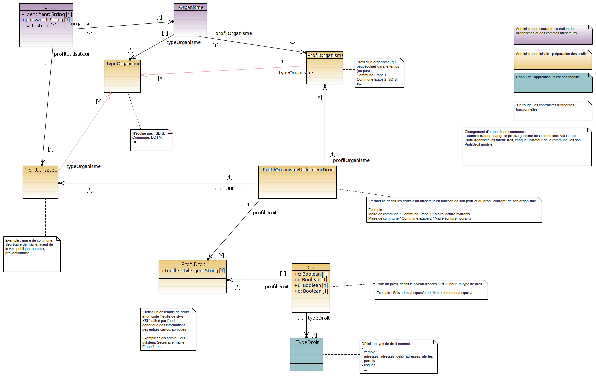

= SDIS Remocra - Gestion des sutilisateurs

ifdef::env-github,env-browser[:outfilesuffix: .adoc]

:experimental:
:icons: font

:toc:

:numbered:

link:../index{outfilesuffix}[Retour à l'accueil]

link:../Manuel%20administration{outfilesuffix}[Retour au manuel d'administration]

'''

== Modèle de données et configuration initiale ==

On distingue trois niveaux :

* Les tables dont le contenu est connu par l'application à l'avance
* Les tables de description des droits et des profils
* Les tables des utilisateurs et organismes

Le modèle est disponible ici :



*Tables connues par l'application (figé)*

La table des types de droits (TypeDroit) n'est pas modifiable : les droits sont connus de l'application et nommés.

*Table des droits et profils (préparation initiale)*

La préparation consiste à remplir les tables dans l'ordre :

* Profils de droits :

** 1 : ProfilDroit
** 2 : Droit

* Profils d'organismes :

** 3 : TypeOrganisme
** 4 : ProfilOrganisme : selon les étapes anticipées (au plus simple : un type d'organisme → une seul ProfilOrganisme)

* Profils d'utilisateurs :

** 4' : ProfilUtilisateur : recense les profils « logiques »

* Liens entre les profils et les droits :

** 5 : ProfilOrganismeUtilisateurDroit : fait le lien entre les types d'organismes, les « étapes » de l'organisme, les profils utilisateurs et les droits.

*Table des Utilisateurs et Organismes (administration)*

Les tables « Utilisateur » et « Organisme » sont utilisées. Elle constituent les étapes 6 et 7 (administration courante) :

** 6 : Organisme
** 7 : Utilisateur


== Administration courante ==

L'administration courante consiste à _créer des organismes et des utilisateurs_.
En ce qui concerne l'application Hydrants, les communes entreront progressivement dans le dispositif. Cette progression est modélisée par les profils d'organismes : « Commune Etape 1 », « Commune Etape 2 », etc. Ainsi, lorsqu'une commune change d'étape, l'administrateur n'a qu'une opération à réaliser : il modifie le profil de la commune. Cette modification impacte les droits de tous les utilisateurs concernés.

*Avantage de ce modèle* :
L'administrateur peut préparer les droits dès le lancement du projet. Lorsque le temps est venu pour un organisme de changer d'étape, une seule opération permet de modifier les droits des utilisateurs de l'organisme sans modifier les profils ou les utilisateurs un par un.

Lorsqu'un nouveau type d'organisme non prévu au départ souhaite entrer dans le dispositif, l'administrateur crée ce type et les profils adéquats. L'application continue de fonctionner sans qu'il ne soit même nécessaire de recompiler le code source.


== Zones de compétences ==

Les zones de compétences sont modifiées directement en base dans la table ```remocra.zone_competence```.
Chaque organisme a une zone de compétence attribuée. Cette attribution peut être réalisée dans l'interface d'administration de Remocra.

== Accès à l'interface d'administration ==

Les interfaces sont accessibles via le bloc "Administration" de la page d'accueil privée.
Les étapes listées au début de cette page sont listées dans le menu déroulant.

== Profils particuliers ==

Les utilisateurs qui ont un profil qui porte un des codes suivants sont spécifiques (profil_droit.code) :

* _SDIS-REF-PENA_ : destinataires des emails des traitements "Etat des hydrants PENA"
* _SDIS-REF-DECI_ : destinataires des emails des traitements "Etat des hydrants PIBI"
* _SDIS-ADM-PERMIS_ : destinataires des emails du traitement "Liste des permis"