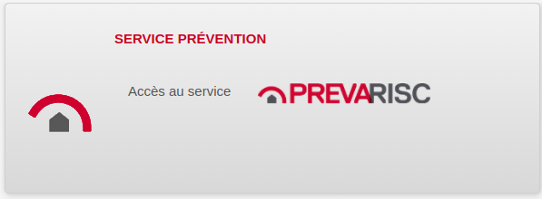

= SDIS Remocra - Lien avec Prevarisc

ifdef::env-github,env-browser[:outfilesuffix: .adoc]

:experimental:
:icons: font

:toc:

:numbered:

link:../index{outfilesuffix}[Retour à l'accueil]

link:../Manuel%20administration{outfilesuffix}[Retour au manuel d'administration]

'''

Cette page évoque les liens entre link:https://github.com/atolcd/sdis-remocra[Remocra] et https://github.com/SDIS62/prevarisc[Prevarisc].

== Authentification ==

Depuis Remocra, il est possible pour un utilisateur ayant accès à Prevarisc d'accéder directement à ce dernier sans avoir besoin de resaisir son mot de passe.



Le principe est le suivant :

* Remocra génère un jeton jwt signé (avec une clé privée) à durée de vie courte, qui comporte l'identifiant de l'utilisateur
* Le jeton est transmis au service tiers (prevarisc) via une redirection HTTP.
* Le service tiers (prevarisc) vérifie le jeton à partir de la clé publique paramétrée.
* Si tout est cohérent, l'utilisateur est authentifié.

Remarque :

* Les identifiants _Remocra_ et _Prevarisc_ de l'utilisateur doivent être identiques.

=== Mise en place au niveau de Remocra ===

L'exemple suivant est valable pour une connexion à Prevarisc.

**Génération des clés** aux formats pem et der (RSA 2048-bit, PKCS#8) :

[source,sh]
----
# root@remocra.sdisxx.fr
KEYNAME=remocra
mkdir -p /var/remocra/keys
cd /var/remocra/keys
openssl genrsa -out ${KEYNAME}_key.pem 2048
openssl pkcs8 -topk8 -inform PEM -outform DER -in ${KEYNAME}_key.pem -out ${KEYNAME}_key.der -nocrypt
openssl rsa -in ${KEYNAME}_key.pem -pubout -outform DER -out ${KEYNAME}_pub_key.der
openssl rsa -in ${KEYNAME}_key.pem -pubout -outform PEM -out  ${KEYNAME}_pub_key.pem
----

**Configuration de Remocra** via l'interface d'administration :

* Clé publique (.der) pour les jetons jwt (SORTIE_JWT_CLEPUBLIQUE) : ```/var/remocra/keys/remocra_pub_key.der```
* Clé privée (.der) pour les jetons jwt (SORTIE_JWT_CLEPRIVEE) : ```/var/remocra/keys/remocra_key.der```
* Service générateur des jetons jwt (SORTIE_JWT_ISSUER) : ```remocra```
* Durée de validité des jetons jwt en secondes (SORTIE_JWT_VALIDITE_SEC) : ```30```

Exemple de lien d'accès à Prevarisc :

* https://remocra.sdisxx.fr/remocra/sso/out/jwt?service=prevarisc&url=https%3A%2F%2Fprevarisc.sdisxx.fr%2Fsession%2Flogin

**Configuration d'un bloc dans la page d'accueil**

Exemple de bloc avec une visibilité restreinte aux administrateurs (et un autre profil inexistant ici) :
[source,json]
----
{
    type : 'info',
    title : 'Service prévention',
    icon : 'ext-res/images/remocra/blocs/prevarisc.png',
    profils : ['SDIS-ADM-APP', 'UN-AUTRE-PROFIL'],
    content : '<div style="float: left;display: block;margin: 1em;">Accès au service</div>'
        + '<div style="float: left;display: block;margin: 1em;"><a href="sso/out/jwt?service=prevarisc&url=https%3A%2F%2Fprevarisc.sdisxx.fr%2Fsession%2Flogin" target="_blank">'
        + ''
        + '</a></div>'
}
----

=== Mise en place au niveau de Prevarisc ===

**Déposer le plugin et la clé publique :**

* /var/www/prevarisc/application/plugins/JwtAuth.php
** _link:https://github.com/cvagner/prevarisc/blob/auth-jwt/application/plugins/JwtAuth.php[disponible ici] dans l'attente d'intégration dans le projet commun_
* /var/www/prevarisc/keys/remocra_pub_key.pem
** _clé publique générée précédement côté Remocra_

**Installer la dépendance jwt :**

[source,sh]
----
cd /var/www/prevarisc && php composer.phar require --prefer-dist emarref/jwt
----

**Activer et configurer le plugin** dans le fichier

./etc/apache2/sites-available/prevarisc
[source,sh]
----
SetEnv PREVARISC_THIRDPARTY_PLUGINS Plugin_JwtAuth
SetEnv PREVARISC_JWT_AUTH_AUDIENCE prevarisc
SetEnv PREVARISC_JWT_AUTH_PUBLICKEY_REMOCRA /var/www/prevarisc/keys/remocra_pub_key.pem
----

Pour finir, recharger la configuration d'Apache :

[source,sh]
----
service apache2 reload
----

**Test final**

* Se connecter à Remocra et cliquer sur le lien Prevarisc du bloc configuré.

Remarque :

* Veillez à ce que les deux serveurs soient bien à l'heure.