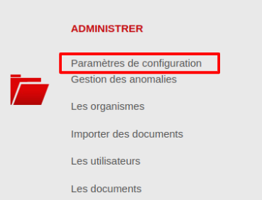
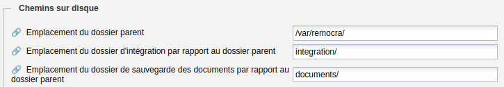
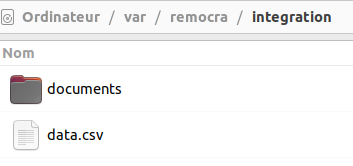
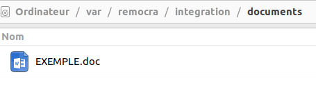
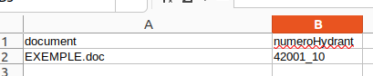
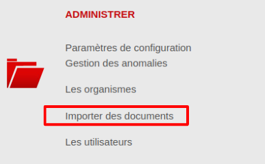
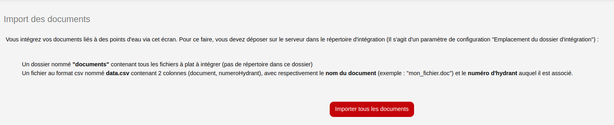
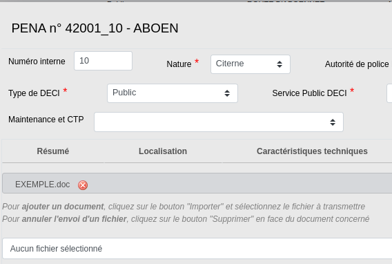
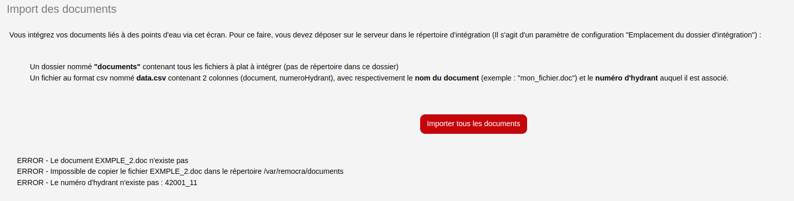

= Remocra - Import de documents reliés à des PEI

== 1. Paramètre de configuration à définir

Pour pouvoir utiliser cette fonctionnalité, il faut au préalable renseigner 3 paramètres
de configuration (Image 2) accessibles depuis l'application Remocra : Administrer > Paramètres de
configuration > Chemins sur le disque.

_Image 1 : Accès aux paramètres de configuration_

_Image 2 : Paramètres à renseigner_

* Théoriquement, le dossier parent correspond à */var/remocra/*
* Le dossier d'intégration correspond au dossier où vous allez stocker les documents le temps de l'intégration des documents
* Le dernier sera le dossier où seront stockés tous les documents

Pour les deux derniers points, il s'agit du chemin relatif.

Vérifiez bien que les dossiers existent sur votre disque.

== 2. Dépôt des documents sur le disque

Dans le dossier d'intégration, 2 éléments vous sont demandés :

* Un dossier nommé *documents* qui contiendra tous les documents à intégrer
* Un fichier nommé *data.csv* contenant le lien entre les documents et les PEI

_Image 3 : Détail du dossier d'intégration_

Dans le dossier "documents", déposez tous vos documents.

Dans le fichier data.csv, 2 colonnes sont attendues :

* Une colonne "document" représentant le nom (avec l'extension) d'un document placé dans le répertoire *documents* vu dans la partie 2
* Une colone "numeroHydrant" représentant le numéro de l'hydrant auquel le document va être associé

_Attention : La ligne d'entête est obligatoire et le nom des colonnes doit être respecté pour que le processus fonctionne.
Aucune arborescence ne doit être faite dans le dossier "documents". Le fichier data.csv doit être encodé en UTF8
et doit avoir le séparateur "," pour pouvoir être utilisé._

Voici un exemple :

_Image 4 : Documents à intégrer_

_Image 5 : Exemple de fichier data.csv_

== 3. Utiliser la fonctionnalité

Pour utiliser la fonctionnalité, cliquez sur Administrer > Importer des documents

_Image 6 : Utiliser la fonctionnalité d'import de document_

Vous arrivez donc sur la page suivante :

_Image 7 : Page de la fonctionnalité_

Cliquez alors sur le bouton "Importer tous les documents".

En reprenant notre exemple de la partie 2, nous retrouvons bien le fichier "EXEMPLE.doc" dans la fiche du PEI :

_Remarque : Si des erreurs se sont produites, elles s'afficheront en bas de la page, comme le montre l'image 8._

_Image 8 : Exemples d'import de documents avec des erreurs d'import_
